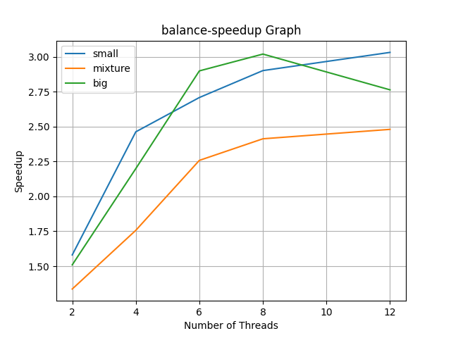
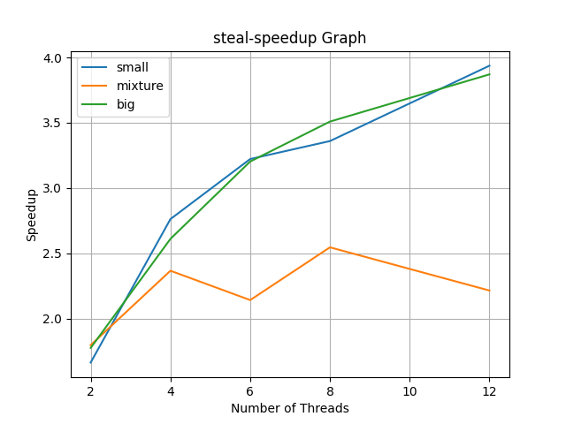

# Concurrent-filter-tool-with-image-convolution
An image processing system that runs on a CPU, reads a series of images, and applies specific effects to them using image convolution

## Problem & Description
I created an image processing system that runs on a CPU, reads a series of images, and applies specific effects to them using image convolution. To achieve the high concurrency of computation, except for the sequential pattern, I implemented the Work Balance parallel pattern and Work Stealing pattern.

Finally, I benchmarked those two parallel patterns and generated each speedup graph (compared with the sequential pattern).

## Instruction
- data source: https://www.dropbox.com/s/cwse3i736ejcxpe/data.zip?dl=0
- We can use sbatch to directly run the `draw_graph.py` file in the `/benchmark` directory. This python file will run each pattern by subprocess and generate the graphs in the same directory. (NOTICE: it is better to run the project locally, because running remotely can be very slow)
```
$: python3 draw_graph.py
```
or
```
$: sbatch YOUR_SHELL_FILE.sh 
```
- It is easy to test each pattern with arguments in `/editor` directory. We can use:
```
$: go run editor.go big balance 4
```
- There are two different paths to store the dataset. The declare of data path is in `/utils/utilFunction.go`. It was designed as below:
```
var REMOTE_DATADIR = "/dev/shm/data"
var LOCAL_DATADIR = "../data"
var DATADIR = LOCAL_DATADIR
```
We can choose the DATADIR equals to `LOCAL_DATADIR`, otherwise the `REMOTE_DATADIR` if in the Linux cluster (Notice: If using the `sbatch` command to run the project, we can only choose the `LOCAL_DATADIR`). Also, user can change it to their preferred path.
- To reuse functions, I created the `utilFunction` in `/utils` package to store tool functions. Besides, I put the common struct and corresponding methods used by both balance and stealing patterns in `concurrent/utils.go`.

## Challenges
In this project, the concurrent part is difficult to implement. To make sure that work balance and work steal pattern can be resued (i.e. Encapsulate them), we need to design concurrent interface and unbounded queue to implement them. The concurrent interface is comparatively difficult. The taks in the unbounded queue can be 'Callable' or 'Runnable'. Each of them should be verified and be handled slightly different.

Also, since in golang there is no `synchronized` method in Java. We need to implement corresponding lock in the unbounded queue.

## Testing 
- I tested both locally and remotely (in the Linux cluster). The graph shown in the report is the result of local test. Besides, Linux cluster test will generate similar result.
- Local: 
```
Core architecture - Apple M1 Pro arm64, 3000 MHz
Number of threads (cores) - 8
Operating system - Macos
Memory - 16GB
```

- Remote: 
```
Core architecture - Intel x86_64
Model name - Intel(R) Xeon(R) CPU E5-2420 0 @ 1.90GHz
Number of threads - 24
Operating system - ubuntu
OS version - 20.04.4 LTS
```

## Hotspots & Bottlenecks
- In the sequential version, the hotspots are the I/O operation and image processing (i.e. the convolution steps). When there are many images to process, and we should use the ‘load’ and ‘save’ methods to read and save the big-size images, it can be very slow. 
- Secondly, in the sequential pattern, we use only one thread to compute each convolution in each pixel, which is computationally intensive. Those two points can also be bottlenecks in the sequential program.

## Analysis & Limitation




- The performance of Work Steal mode is better than Work Balance mode. This is because work stealing reduces the idle time of threads in the case that the threshold to balance in work balancing is too low i.e. the difference in thread local queue sizes is greater than, and therefore, the overall throughput of the application is increased. In my experiments, I tried to keep the threshold as low as possible to see the difference between the two modes. The graphs above are with a balance threshold of 1 which has been hardcoded in the benchmark/benchmark_graph.py script but can be specified via the command line when running the Go program.
- Besides, we can see that in the work steal pattern, the line still keep high Slope even between 8 threads and 12 threads. That is to say, the overhead of the communication and synchronization between the threads increases can still be amortized.
- Besides, the size will influence the speed up performance. When the problem size is large enough, the overhead of spawning new goroutines is low compared with the total speedup. There is a better utilization of available resources and, consequently, a higher speedup. Therefore, the line of the big dataset is high.
- Compared with small, big and mixture lines. We can see that in both graphs, the mixture line is the lowest one. That is because in the mixture dataset, the sizes are different. When some workers assigned with small graph finished their image task, other workers are still working. Therefore, some threads will be idle for a period of time. However, the difference of queue size didn't reach the balance threshold, which cannot trigger the load balancer or no steal operation. The advantage of this parallel pattern cannot show up.
- In the parallel pattern, it is better to implement a global queue along with a bunch of local queues (workers), whenever a task is submitted to the executor service, it will be stored into the global queue first. And the tasks in global queue will be grabbed by the workers into their local queue. In this way, the pushBottom() and popBottom() will only be invoked by the local queue thread, so they will never be called concurrently. The work will be directly submitted to a random local queue. Therefore, local queue can be alled concurrently. Although I used mutex to avoid data inconsistency, it can lower the speed of working queue.

## Comparison
- In my graph, the work steal pattern performed better. I perceive that it is because work stealing mode reduces the idle time of threads. The graphs above are with a balance threshold of 2 which has been hardcoded in the benchmark/benchmark_graph.py script but can be specified via the command line when running the Go program. In my case of big or small dataset, the computing tensity of each worker is similar (i.e. there would not be situations that some threads has very large workload). Therefore, the difference between each local queue size will always be lower than the threshold, in which the balancer will not work. I explained this situation in the Limitation part.